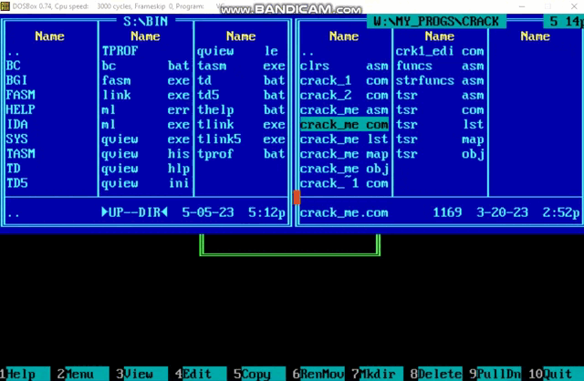

# Написание CrackMe

 В этой части работы нужно было создать свой файл, чтобы предоставить его для взлома другому человеку. Была составлена программа, запрашивающая пароль, сверяющая его с правильным и выдающая либо ограничивающая доступ пользователю. В программу специально были заложены некоторые уязвимости, чтобы её взлом представлялся возможным. Оппоненту, который должен был взломать программу, передавался только бинарный файл, который необходимо было продизассемблировать, выявить слабые места и получить доступ (надпись "ACCESS GRANTED" на экране).

 Пример работы моего CrackMe:

 
